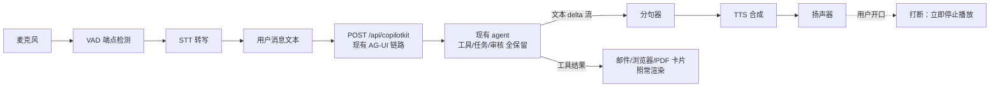

# 个人助手改造设计方案

> 目标：把 OpenMuse 改造成一个**自己的语音助手** —— 能打字、能听我说、能说给我听，
> 模型全部可配置，打包成 macOS / Windows / Linux / iOS / Android 五端，形象为原创的"管家型 AI"。

本方案基于对当前代码的实际核查（不是照搬 README）。核查结论见第 0 节。

---

## 0. 需求 vs. 现状（先对齐差距）

| 你的需求 | 当前状态 | 差距 |
| --- | --- | --- |
| 打字沟通 | ✅ 完整（CopilotKit chat + AG-UI 流式） | 无 |
| 语音输入 | ❌ **零实现** —— 全仓库搜不到 audio/speech/mic 任何代码 | 全新开发 |
| 语音回复 | ❌ **零实现** | 全新开发 |
| 模型可配置 | ⚠️ 只有 `.env` 的 `MODEL` + 三个固定 provider key（`agent.ts:14-26` 硬编码） | 需要配置层 + UI |
| 保留现有能力 | ✅ 现有：邮件/日历/浏览器/Linux 电脑/任务/目标/监控/PDF/记账 | 不能破坏 |
| macOS/Win/Linux 包 | ❌ **完全没有** —— 无 electron/tauri 任何痕迹 | 全新开发 |
| iOS/Android 包 | ⚠️ 只能导出 JS bundle，**不产出签名安装包** | 需要签名 + 构建流水线 |
| 贾维斯形象 | 单点可换：`ui.tsx:402` 的 `Mascot` 组件 + `assets/capybara.png` | 换图 + 图标全端适配 |

**关键结论：语音和桌面端是两块全新的地基，不是改改配置就能有的。**

---

## 1. 三个核心决策（先看这个）

| # | 决策 | 选择 | 一句话理由 |
| --- | --- | --- | --- |
| 1 | 语音走什么架构 | **级联管线**（STT → 现有文本 agent → TTS），不用 Realtime 语音模型 | 实时语音模型会绕过你的任务/审核/卡片体系，等于把项目最值钱的部分扔掉 |
| 2 | 桌面端怎么来 | **Tauri 包一层现有的 Web 构建** | 项目已经能导出 Web 版，一套 RN 代码直接变五端 |
| 3 | 形象怎么做 | **原创"管家型 AI"**，不用 JARVIS 名字和形象 | "卡通贾维斯"仍然是衍生物，不能规避侵权 |

---

## 2. 语音架构

### 2.1 为什么不用 Realtime / Speech-to-Speech API

现在很流行 GPT Realtime 这类"直接语音进、语音出"的模型，听起来更适合语音助手。**但这个项目不能用**，原因是 OpenMuse 的全部价值建立在文本事件流上：

- 对话要存进 Rich Threads，跨设备恢复 —— Realtime 的音频流没有可持久化的文本消息
- 邮件卡片、浏览器预览、PDF 卡片都是**从工具调用结果渲染**的 —— 语音通道里没有这些 UI 锚点
- **审核机制**（发邮件/改日历必须点确认）依赖明确的界面动作 —— 语音里"批准"无法绑定到具体的收件人和内容
- 任务的计划、步骤、回执都挂在文本 conversation 上

换成 Realtime 等于重写整个 agent 层。所以正确的做法是：

> **语音是套在现有 agent 外面的一层 I/O 外壳，里面一行都不动。**

这样你的需求"当前能力都要在"自动满足。

### 2.2 数据流



关键点：**音频只在两端，中间全程是现有的文本协议。**

### 2.3 客户端 / 服务端职责划分

**决策：STT/TTS 走服务端代理，不放在客户端。**

| 方案 | 优点 | 缺点 | 结论 |
| --- | --- | --- | --- |
| 端上原生（iOS Speech / Android SpeechRecognizer / Web Speech） | 免费、离线、零延迟 | 五端质量参差、中文效果不稳、**无法统一配置模型** | 作为降级/离线兜底 |
| **服务端代理** | 密钥不落客户端、五端体验一致、**一处配置五端生效** | 需要网络、服务器要能跑 | ✅ **主方案** |

这也和项目现有安全姿态完全一致 —— README 明确写了 "Provider keys stay on the server"，媒体走短时签名 URL。语音应该follow同一套。

### 2.4 延迟预算（决定体验生死）

| 环节 | 目标 | 优化手段 |
| --- | --- | --- |
| 说完 → 上传完成 | < 100ms | 16kHz 单声道，几十 KB |
| STT 出最终文本 | 300–800ms | 流式识别，边说边出 |
| LLM 首 token | 500–1500ms | 已有的流式 |
| 首句 TTS 出音频 | 200–500ms | **分句流式**，不等全文 |
| **合计到第一声** | **~1–2.8s** | 可用 |

⚠️ **最容易翻车的地方**：如果等整段回复生成完再合成语音，遇到长回复（比如"研究水族馆并推荐三个展馆"）要等十几秒才出声。**必须做分句流式 TTS** —— 检测到句末标点（。！？.!?\n）就立即把这一句送去合成，边生成边播放。

### 2.5 交互设计

| 能力 | 设计 | 阶段 |
| --- | --- | --- |
| 按住说话 | 输入框加麦克风按钮，按住录音、松开转写。**必须有** —— 最可靠的输入方式 | v1 |
| 识别预览 | 转写文本先填进输入框让你确认/修改，再发送（可配置为自动发送） | v1 |
| 朗读回复 | 助手回复完成后朗读 | v1 |
| 单条重播 | 每条助手消息旁一个喇叭图标 | v1 |
| 全局静音 | 顶部开关 | v1 |
| **打断（barge-in）** | 播放中检测到用户开口 → 立即停止播放。**语音助手的灵魂** | v2 |
| 免提模式 | VAD 自动断句，不用按 | v2 |
| 唤醒词 | "Hey XXX" —— 需要常驻监听，耗电且各端实现差异大 | v3，可选 |

### 2.6 朗读什么？（容易被忽略的设计）

助手回复里有 Markdown、代码块、URL、卡片引用。直接念会很难听。需要一个**文本 → 可朗读文本**的归一化层：

- 剥掉 ```代码块```、表格、Markdown 标记
- 链接 `[文字](url)` → 只念"文字"
- 卡片引用 → 跳过或念"（详情见上方卡片）"
- 超长回复 → 念前 N 句 + "完整内容在屏幕上"
- 数字/单位/日期做口语化（可选，中文尤其需要）

建议放 `packages/voice/src/speakable.ts`，纯函数，好测。

### 2.7 录音格式（一个能省掉整个 ffmpeg 的决定）

各端录音格式天然不同：iOS 出 m4a/aac，Android 出 m4a/3gp，Web 出 webm/opus。如果直接上传，服务端就得装 ffmpeg 转码。

**决策：客户端统一录 16kHz 单声道 PCM/WAV。** 这是所有 STT 服务都原生接受的格式，体积也就几十 KB/秒，**直接省掉 ffmpeg 依赖**（对桌面端打包尤其重要）。

---

## 3. 模型配置层（"可配置"的落地）

### 3.1 现状

- `MODEL` 环境变量 + `OPENAI_API_KEY`/`ANTHROPIC_API_KEY`/`GOOGLE_API_KEY` 三选一
- 判断逻辑写死在 `apps/server/src/agent.ts:14-26`
- 没有任何 UI，改模型要改 `.env` 重启

### 3.2 设计：统一能力注册表

四类能力，每类独立可配：

```jsonc
{
  "llm":      { "provider": "openai",    "model": "gpt-...",      "baseUrl": null },
  "stt":      { "provider": "openai",    "model": "whisper-...",  "language": "zh" },
  "tts":      { "provider": "elevenlabs","voiceId": "...",        "speed": 1.0 },
  "realtime": { "enabled": false }
}
```

**解析优先级：单次请求覆盖 → 数据库（用户在 UI 里的设置）→ 环境变量（首次启动的引导默认值）。**

新增 `packages/models/` 定义 provider 接口：

```ts
export interface SpeechToText {
  transcribe(input: { audio: Uint8Array; mimeType: string; language?: string }):
    Promise<{ text: string; language?: string }>;
}
export interface TextToSpeech {
  synthesize(input: { text: string; voiceId: string; format: "mp3" | "opus" | "wav" }):
    Promise<{ audio: Uint8Array; mimeType: string }>;
}
```

好处：加一个新 provider = 加一个文件，不动业务代码。你以后想换任何模型都不用改架构。

### 3.3 密钥安全（直接复用现有的）

项目里**已经有** `packages/integrations/src/vault.ts`：AES-256-GCM 版本化信封，用 `TOKEN_ENCRYPTION_KEY`。

语音 provider 的 key 直接复用这套加密后存库，**永远不返回给客户端**（读接口返回掩码 `sk-...abcd`）。

### 3.4 新增接口

| 方法 | 路径 | 用途 |
| --- | --- | --- |
| GET | `/api/settings/models` | 读配置（密钥掩码） |
| PUT | `/api/settings/models` | 写配置（zod 校验 + 加密密钥） |
| POST | `/api/settings/models/test` | **连通性自检** —— 很实用，避免"配完不知道对不对" |
| GET | `/api/voice/voices` | 可用音色列表 |
| POST | `/api/voice/transcribe` | 音频 → 文本 |
| POST | `/api/voice/speak` | 文本 → 音频流 |
| WS | `/api/voice/stream` | （v2）流式双向，降延迟 |

⚠️ **一个现成的坑**：`app.ts:54` 全局设了 `Cache-Control: no-store`。TTS 音频需要客户端缓存（同一句话重复播放不该重复计费），这条路由要单独放开。

### 3.5 UI

现有 `Apps` 里已经有 `ConnectionsScreen`（`screens.tsx:1173`），新增一个 `AssistantSettingsScreen` 放在同一层级：模型选择、音色试听、语言、语速、免提开关。

---

## 4. 五端打包

### 4.1 平台矩阵

| 端 | 技术 | 产物 | 分发 |
| --- | --- | --- | --- |
| iOS | Expo RN（现有） | .ipa | TestFlight → App Store |
| Android | Expo RN（现有） | .apk / .aab | 侧载 / Google Play |
| macOS | **Tauri v2** + Web 构建 | .app / .dmg | 公证 DMG |
| Windows | **Tauri v2** | .msi / .exe | NSIS 安装器 |
| Linux | **Tauri v2** | .deb / .AppImage | AppImage 免安装 |

### 4.2 桌面端选型

| 方案 | 体积 | 评价 |
| --- | --- | --- |
| **Tauri v2** ✅ | ~10MB | 用系统 WebView，体积极小，原生菜单/托盘/通知/自动更新齐全，Rust 侧可托管本地服务 |
| Electron | ~150MB | 成熟一致，但体积大、内存高 |
| RN for Windows/macOS | — | 要维护第三套平台代码，RN-macOS 社区维护，工作量最大 ❌ |

**选 Tauri。** 关键前提已经具备：项目**已经**是 Web 可用的（`PdfReader.web.tsx`、`BrowserConsole.web.tsx` 都是现成的一等实现），Tauri 直接包 `expo export --platform web` 的产物。

### 4.3 桌面端要不要自带服务端？

这是个**产品形态决策**，本方案建议**两种都支持**：

- **本地模式（默认）**：桌面 App 内嵌一个 OpenMuse 服务端 sidecar，双击即用，数据全在本机
- **远程模式**：桌面/手机都连你自己的一台服务器 —— **这才是杀手锏：手机上跟你 Mac 上跑的服务端对话**

sidecar 打包的三条路：

| 方案 | 说明 | 建议 |
| --- | --- | --- |
| 打包 Node 运行时 + `dist/` 作为 Tauri resource | 最稳，~80MB | ✅ **首选** |
| Node SEA / 单文件可执行 | 体积小，但 PGlite 的 WASM 加载有风险 | 后续优化 |
| 要求用户自己装 Docker | 体验差 | ❌ |

另外桌面端有两个重依赖要处理：
- **浏览器功能**：需要 Playwright Chromium（+150–300MB），建议**首次运行时下载**，而不是塞进安装包
- **Linux 电脑**：需要 Docker Desktop，**绝大多数用户没有** —— 默认关闭，界面优雅降级（现在 `browserConfigured: false` 那套提示机制可以直接复用）

### 4.4 一个必须先做的小重构

`apps/mobile/src/api.ts` 现在是这样：

```ts
export const API_URL = (process.env.EXPO_PUBLIC_API_URL || ...).replace(/\/$/, "");
```

**模块加载时求值一次**，由构建时内联的环境变量决定。桌面端需要在运行时切换"本地/远程"服务端，所以必须先改成**运行时可解析**（从配置存储读，带启动期覆盖）。这个改动很小但**是前置依赖**。

### 4.5 签名与成本（现实问题，提前知道）

| 项目 | 费用 | 是否必需 |
| --- | --- | --- |
| Apple Developer Program | $99/年 | iOS 真机安装 + TestFlight + **macOS 公证**必需 |
| Google Play 开发者 | $25 一次性 | 上架 Play 才需要；侧载 APK 免费 |
| Windows 代码签名证书 | ~$200–400/年 | 非必需，但不签会有 SmartScreen 警告 |
| Expo EAS | 有免费额度 | 移动端构建建议用 |

**如果只是自己用**：iOS 走免费 Apple ID 真机调试（7 天有效期，需重装）、Android 直接侧载 APK、macOS 不公证直接跑（首次要右键打开）—— **成本可以压到 0**。

---

## 5. 形象与品牌（JARVIS 这件事要讲清楚）

### 5.1 直接说结论：不能叫 JARVIS

我不是律师，但这是行业常识性的风险判断：

- **JARVIS 是 Marvel / Disney 的 IP** —— 名称、角色、金红配色、方舟反应堆、HUD 视觉语言，都是被保护的
- **"卡通版贾维斯"并不能规避** —— 衍生物仍然是衍生物，改画风不改变侵权认定
- **名称风险最高**：App Store / Play 商店的应用名、图标、截图里出现 "JARVIS"，是最容易被投诉下架的位置
- **绝对不能做的事**：克隆 Paul Bettany（或其他真人演员）的声音 —— 这同时踩声音权/肖像权

### 5.2 可以安全保留的是"气质"

"冷静、克制、专业、略带英式管家腔的 AI" —— 这个**人设原型本身不受保护**，是通用科幻母题。所以策略是：

> **保留气质，去掉 IP。**

| 不要 | 改成 |
| --- | --- |
| 名字 JARVIS / JARO / JARV 等近似名 | 完全不同的原创名（见下） |
| 金 + 红 + 方舟反应堆 | 青蓝 / 冷白单色发光核心 |
| Marvel 式 HUD 框线、装甲元素 | 几何多面体 / 环形粒子 / 呼吸脉冲 |
| 真人演员音色 | 商业 TTS 的"英式男声·沉稳"预设音色 |

⚠️ 特别提醒：**别用 J 开头近音名**（JARO、JARV、JARVIX 之类）。商标侵权判断里有"混淆性相似"这一条，同类别（AI 助手软件）下近似名反而更危险，不如彻底区分开。

### 5.3 命名候选

| 名字 | 气质 | 备注 |
| --- | --- | --- |
| **VESPER** ⭐ | 拉丁语"黄昏星"，冷静、正式、有距离感 | 推荐，与管家型 AI 气质契合 |
| ORION | 猎户座，大气、科技感 | 通用词，重名较多但风险低 |
| SEVERIN | 正式、老派管家感 | 冷门，冲突少 |
| QUILL | 轻巧、文雅 | 偏文艺 |

**推荐 VESPER 作为默认名。**

但更重要的是——**把名字做成用户可配置的**。现有 app 本来就有"名字、语气、头像可编辑"的设计（README 的 Personal context 一节）。所以：

> 出厂默认原创名 + 允许用户自己改名

这样既满足你"要贾维斯那种感觉"的诉求（你自己改就行），也让**发布的安装包和商店素材里不含任何 IP**。同时建议在用户协议里加一句"请勿使用第三方知识产权名称"。

### 5.4 视觉规范建议

- **主色**：青蓝 `#38BDF8` → `#0EA5E9`，配深海军蓝底 `#0B1220`
- **形态**：抽象能量核心（多面体 / 环形 / 粒子聚合），不用人形、不用装甲
- **动效**：呼吸脉冲（idle）→ 加速旋转（思考中）→ 波形（说话中）
- **复用现成机制**：`ui.tsx:402` 的 `Mascot` 已经支持 `sky/sand/lilac` 三种底色变体，直接把 palette 换成品牌色即可，组件结构不用动

### 5.5 图标交付清单（五端，容易漏）

| 目标 | 规格 | 坑 |
| --- | --- | --- |
| iOS | 1024×1024 + AppIcon 资源集 | **不能有透明通道**，否则审核被拒 |
| Android | 自适应图标 前景 432×432 + 背景；商店 512×512 | 前景要留安全区，会被裁切 |
| macOS | .icns（16→1024 含 @2x） | 圆角和大边距要自己画（系统不再自动加） |
| Windows | .ico（16/24/32/48/64/128/256） | 小尺寸要单独简化，直接缩会糊 |
| Linux | 256/512 PNG + .desktop | AppImage 需要 |
| Web/PWA | 192/512 + maskable + favicon | maskable 要留 40% 安全区 |

**做法**：先做一张 SVG 母版 → 脚本导出全套。项目里已有先例可循 —— 水豚图就是"生成原创素材 + 在 `assets/README.md` 记录来源和生成 prompt"的流程，贾维斯替代形象照这个流程走，顺便把版权来源记录规范沿用下来。

### 5.6 音色

- 用 TTS provider 自带的正版音色（各家都有"英式男声 / 沉稳 / 叙述"这类预设）
- 中文场景要**单独挑中文音色** —— 英文好听的音色说中文经常翻车
- 如果要用声音克隆，**只能克隆你本人**（需你本人授权），绝不克隆公众人物

---

## 6. 仓库改造

```
apps/
  mobile/      改造：+ voice/ 模块、+ 设置页、+ 麦克风权限、替换 Mascot 素材
  desktop/     🆕 Tauri v2 外壳（macOS/Win/Linux）
  server/      扩展：+ voice 路由、+ settings 路由、+ sidecar 启动模式
  worker/      保持（浏览器服务）
  computer/    保持（可选 Docker）
packages/
  voice/       🆕 STT/TTS 适配器 + 可朗读文本归一化 + 分句器
  models/      🆕 provider 注册表 + 配置 schema
  domain/      扩展：语音/设置的共享类型
  integrations/ 复用 vault.ts 加密
```

---

## 7. 分阶段路线图

| 阶段 | 内容 | 工作量 | 可见成果 |
| --- | --- | --- | --- |
| **P0** | 品牌替换：Mascot 换图、应用名/图标/启动屏、去掉 OpenMuse 字样 | ~1 周 | **立刻看到"自己的 App"** |
| **P1** | 语音 v1：按住说话 → STT → 走现有链路 → TTS 朗读；模型配置层 + 设置 UI | ~2–3 周 | 能跟它说话 |
| **P2** | 语音 v2：流式识别、分句流式 TTS、打断、免提 VAD、音频缓存 | ~2–3 周 | **达到可日常使用的流畅度** |
| **P3** | 桌面端：Tauri ×3 平台 + 本地服务 sidecar + 自动更新 | ~3–4 周 | 双击即用的桌面 App |
| **P4** | 移动端出包：EAS Build、签名、TestFlight / APK | ~2 周 | 手机上装得起来 |
| **P5** | 打磨：唤醒词、推送、离线降级、多端同步 | 持续 | — |

**单人大约 3–4 个月**（P0+P1 就能有明显可用的成果）。

**建议的切入点：P0 + P1。** 先让它"变成你的、能对话"，再解决桌面和分发。

---

## 8. 风险清单

| 风险 | 影响 | 应对 |
| --- | --- | --- |
| 语音延迟难压 | 体验差，不想用 | 分句流式 TTS 是硬要求，不是优化项 |
| 中文识别质量不稳 | 核心体验崩 | 先跑 provider 横向评测再定；架构上可随时切换 |
| 桌面 sidecar 打包 | P3 可能延期 | 备选：先只做"连远程服务端"模式 |
| Docker 依赖 | 桌面用户多半没有 | 默认关闭 + 优雅降级（现有机制可复用） |
| 签名成本 | 上架受阻 | 自用可压到 0 成本（见 4.5） |
| IP 风险 | 下架/投诉 | 用原创名 + 原创形象 + 可改名设计 |
| 单用户架构 | 无法多人共用 | 本方案定位自用；多人需单独改造认证层 |

---

## 9. 待你确认的决策

1. **服务端放哪？** 只在自己电脑上跑（简单、免费）／还是放到一台云服务器（手机在外面也能用）？
2. **要不要上架商店？** 上架 → 需要 Apple 开发者账号 + 公证；自用 → 侧载，0 成本
3. **形象最终选哪个名字？** 先用推荐的 VESPER，还是你有偏好？
4. **语音的第一优先级**：按住说话（简单可靠）还是免提唤醒词（炫但复杂）？

---

*本文档为设计方案，尚未开始实施。*
